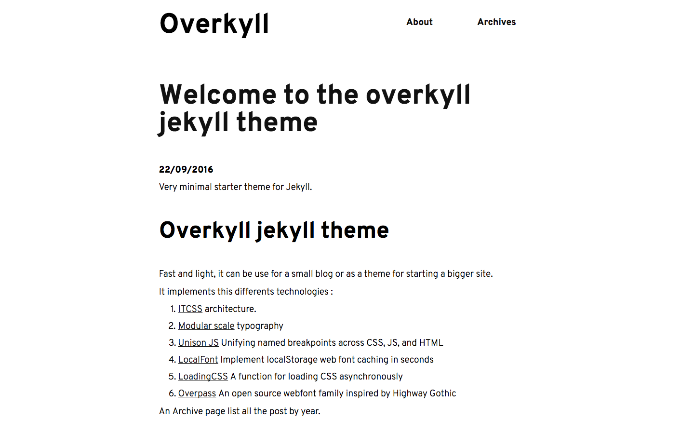

# Overkyll Jekyll Theme

## Install as Gem Theme

Jekyll requires Ruby so make sure Ruby is installed before you begin.

### Start a New Site
- Install Jekyll and Bundler
  - `gem install jekyll bundler`
- Create a New Site
  - `jekyll new mysite`
- Move into that directory
  - `cd mysite`
- Verify
  - Run `bundle exec jekyll serve`
  - Browse to [http://localhost:4000](http://localhost:4000)
- Download Overkyll Theme
  - Replace the line `gem "minima"` with this:
    - `gem "overkyll-jekyll-theme"`
  - Run `bundle install`
- Tell Jekyll to use Overkyll Theme
  - Open `_config.yml` and change the line `theme: minima` to this:
    - `theme: overkyll-jekyll-theme`

### Migrate an Existing Site
**NOTE** This requires you to be upgraded to at least Jekyll 3.3 which added support for themes and assets.

- Download Overkyll Theme
  - Replace the line `gem "minima"` with this:
    - `gem "overkyll-jekyll-theme"`
  - Run `bundle install`
- Tell Jekyll to use Overkyll Theme
  - Open `_config.yml` and change the line `theme: minima` to this:
    - `theme: overkyll-jekyll-theme`

# Jekyll 2.x Method
Jekyll requires Ruby so make sure Ruby is installed before you begin.

- Download this site
  - `git clone https://github.com/bertrandkeller/overkyll-jekyll-theme.git`
- Move into its directory
  - `cd overkyll-jekyll-theme`
- Install Required Gems
  - `bundle install`
- Verify
  - Run `bundle exec jekyll serve`
  - Browse to [http://localhost:4000](http://localhost:4000)
